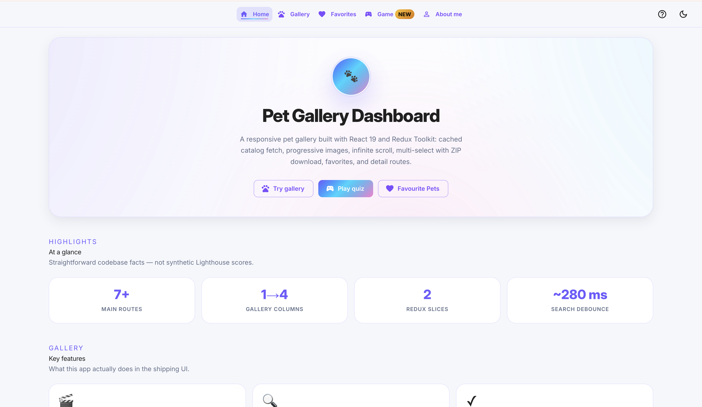
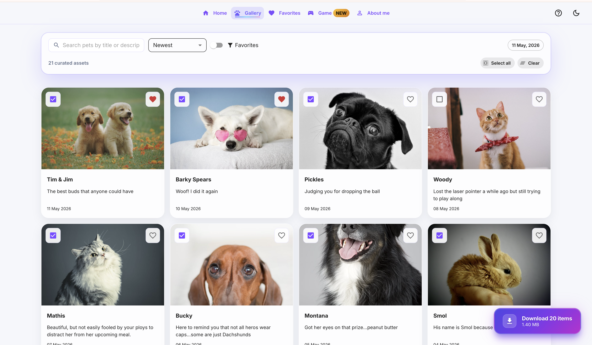
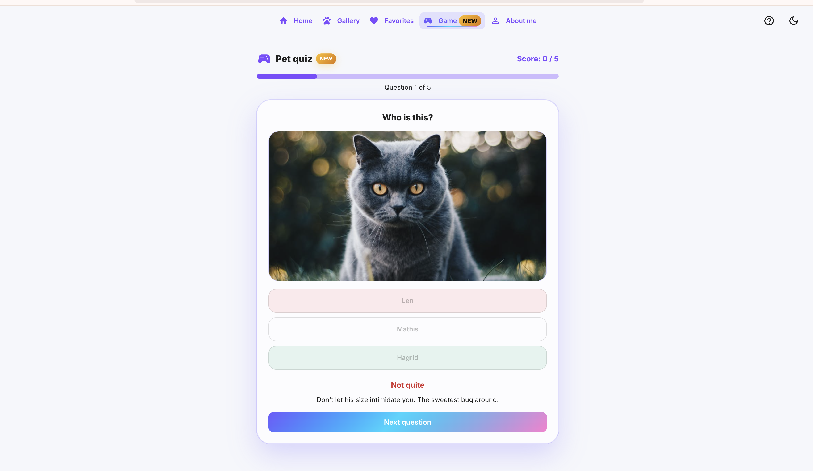
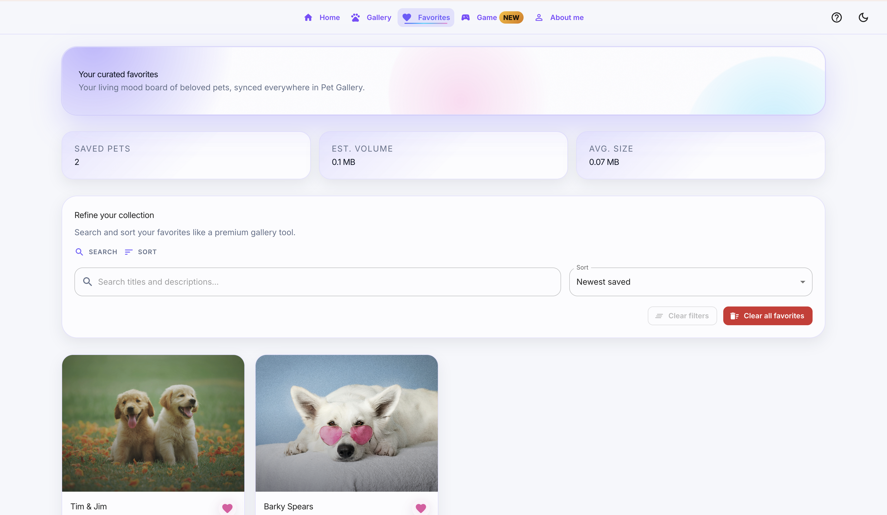
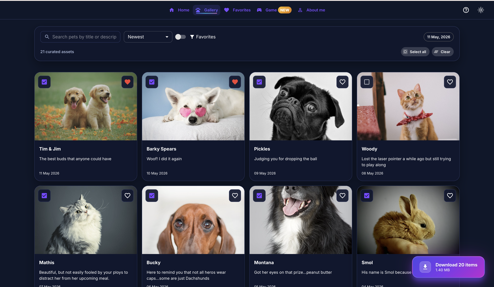
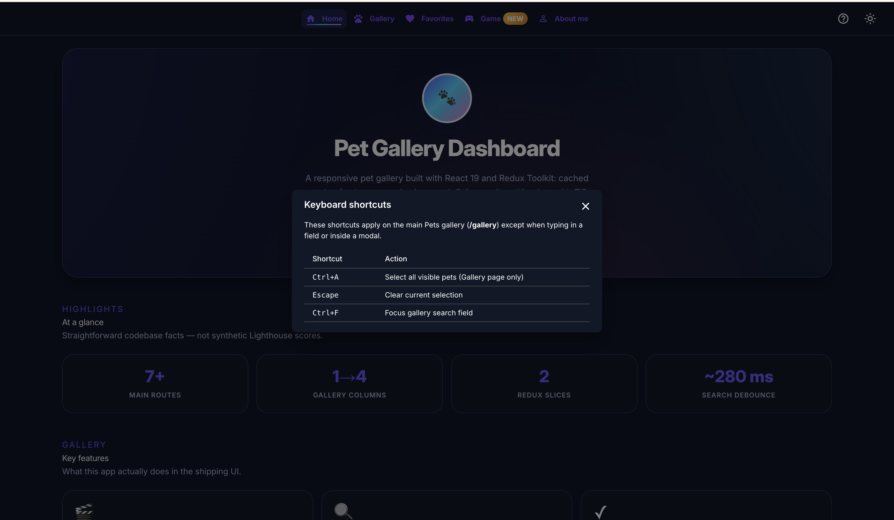

<a id="readme-top"></a>

<div align="center">

# 🐾 Pet Gallery Dashboard

### A modern, responsive pet photo catalog with search, favorites, and an interactive quiz game

[](https://pet-dashboard-olive.vercel.app/)
[](https://www.typescriptlang.org/)
[](https://react.dev/)
[](https://biomejs.dev/)

[Features](#-features) • [App Showcase](#-app-showcase) • [Quick Start](#-quick-start) • [Tech Stack](#️-tech-stack) • [Code Quality](#-code-quality)

</div>

---

## ✨ Features

<table>
<tr>
<td width="50%">

### 🖼️ Gallery Experience
- **📱 Fully responsive** — 1 / 2 / 4 column layouts
- **🔍 Smart search** — Debounced filter on title and description (~280 ms)
- **📊 Sort** — Gallery and favorites (e.g. name, date)
- **∞ Infinite scroll** — Chunked loading with intersection observer (`useInfiniteScroll`)
- **⚡ Image tuning** — `optimizeImageUrl` helper for sizing variants

</td>
<td width="50%">

### 🎯 Interactions
- **✓ Multi-select** — Bulk actions with estimated download sizes
- **❤️ Favorites** — Star pets; dedicated `/favorites` view *(in Redux for the loaded session — hard refresh resets stars)*
- **⬇️ Downloads** — Single files or ZIP batch via `features/pets` download helpers
- **⌨️ Keyboard shortcuts** — Power-user flows + `?` help overlay
- **🎮 Quiz game** — Name-the-pet rounds from live catalog data

</td>
</tr>
</table>

---

## 💡 Project Highlights

Originally built as a **take-home coding challenge** for Eulerity, this project demonstrates production-ready practices:

<table>
<tr>
<td width="50%">

### 🏗️ Architecture
- **Strict TypeScript** with all safety flags enabled
- **Redux Toolkit** for predictable state management  
- **Code splitting** with React.lazy() on all routes
- **Custom hooks** for reusable logic patterns
- **Memoized selectors** for derived state performance

</td>
<td width="50%">

### ✨ Quality & DX
- **Biome** for 10-100x faster linting vs ESLint
- **Husky hooks** prevent broken commits
- **GitHub Actions** on `main` runs lint + production build; **live site** on [Vercel](https://pet-dashboard-olive.vercel.app/)
- **3 responsive breakpoints** (mobile/tablet/desktop)
- **Keyboard shortcuts** for power users

</td>
</tr>
</table>

**Beyond requirements:**
- 🎮 **Quiz game feature** (not in original spec)
- ⚡ **Infinite scroll** with intersection observer
- 🎨 **Glassmorphism UI** with modern design patterns
- ♿ **Accessibility** with focus management
- 📦 **Offline fallback** when API is unavailable

---

## 📸 App Showcase

<div align="center">

### 🏠 Welcome to Pet Gallery Dashboard

<a href="./public/screenshots/dashboard.png" target="_blank" rel="noopener noreferrer">
  
</a>

> **First impressions** — Dashboard home with glass surfaces, quick stats, and a clear path into the gallery.

---

### 🖼️ The Gallery Experience

<a href="./public/screenshots/gallery.png" target="_blank" rel="noopener noreferrer">
  
</a>

<table>
<tr>
<td align="center" width="33%">

**🔍 Smart Search**

Filter by title or description with debounced input (~280 ms)

</td>
<td align="center" width="33%">

**✓ Multi-Select**

Bulk selection with download size estimates

</td>
<td align="center" width="33%">

**∞ Infinite Scroll**

Chunked loading via intersection observer

</td>
</tr>
</table>

---

### 🎮 Interactive Quiz Game

<a href="./public/screenshots/quiz.png" target="_blank" rel="noopener noreferrer">
  
</a>

<table>
<tr>
<td align="center" width="50%">

**📊 Five Questions Per Round**

Three multiple-choice options each

</td>
<td align="center" width="50%">

**🏆 Score Tracking**

Games played, best score, and rolling average

</td>
</tr>
</table>

---

### ❤️ Favorites Collection

<a href="./public/screenshots/favourites.png" target="_blank" rel="noopener noreferrer">
  
</a>

> **Curate your picks** — Star pets in the gallery and revisit them here with the same search and sort affordances.

---

### 🌙 Dark Mode

<a href="./public/screenshots/dark.png" target="_blank" rel="noopener noreferrer">
  
</a>

> **Comfortable at night** — Toggle light/dark from the navbar; contrast and hierarchy stay consistent across surfaces.

---

### ⌨️ Keyboard Shortcuts

<a href="./public/screenshots/shortcuts.png" target="_blank" rel="noopener noreferrer">
  
</a>

<table>
<tr>
<td align="center">

`Ctrl/Cmd + A`

Select all

</td>
<td align="center">

`Escape`

Clear selection

</td>
<td align="center">

`Ctrl/Cmd + F`

Focus search

</td>
<td align="center">

`?`

Show help

</td>
</tr>
</table>

> **Press `?`** in the app to open the full shortcuts overlay.

*Click any image to open it full size in a new tab.*

[⬆ Back to top](#readme-top)

</div>

---

## 🚀 Quick Start

```bash
# Clone the repository
git clone https://github.com/koyakhare/Pet-Dashboard.git
cd Pet-Dashboard

# Install dependencies
npm install

# Start development server (Vite default)
npm run dev
# → http://localhost:5173

# Build for production (runs type-check first)
npm run build

# Preview production build
npm run preview
```

### 🌐 Live Demo

**[pet-dashboard-olive.vercel.app](https://pet-dashboard-olive.vercel.app/)**

---

## 🛠️ Tech Stack

<div align="center">

| Category | Technologies |
|:--------:|:-------------|
| **Core** |    |
| **State** |  |
| **Routing** |  |
| **Styling** |    |
| **Quality** |    |

</div>

---

## 🎯 Code Quality

This project uses **strict TypeScript** and **fast, unified tooling** for day-to-day work.

### 🔒 Type Safety

<table>
<tr>
<td width="50%">

**Strict TypeScript** ([`tsconfig.json`](tsconfig.json))

```json
{
  "strict": true,
  "noUncheckedIndexedAccess": true,
  "noImplicitReturns": true,
  "exactOptionalPropertyTypes": true,
  "noPropertyAccessFromIndexSignature": true
}
```

</td>
<td width="50%">

**Why It Matters**

- Narrower gaps between compile-time contracts and runtime behavior
- Indexed access and optional props are modeled explicitly
- Stricter member access rules on typed maps and records

</td>
</tr>
</table>

### ⚡ Biome for Lint & Format

**Why Biome?** One toolchain for lint + format + import sorting — typically much faster than an ESLint + Prettier pipeline.

```bash
npm run lint         # biome check .
npm run lint:fix     # biome check --write .
npm run format       # biome format --write .
npm run type-check   # TypeScript validation (src + vite.config helper project)
npm run build        # type-check, then vite build
```

Recommended: **[Biome VS Code extension](https://marketplace.visualstudio.com/items?itemName=biomejs.biome)** (`biomejs.biome`). Workspace hints live under [`.vscode/`](.vscode/).

> Pinned **Biome 1.9.x** (`@biomejs/biome` in [`package.json`](package.json)); rules live in [`biome.json`](biome.json).

### 🪝 Git Hooks (Husky)

| Hook | Action |
|------|--------|
| **Pre-commit** | `lint-staged` → Biome on staged files + `tsc --noEmit` when TS/TSX changes |
| **Pre-push** | Full **`npm run build`** (already includes **`npm run type-check`**) |

**Bypass only when you must:**

```bash
git commit --no-verify
git push --no-verify
```

### 🔄 CI & deployment

**Continuous integration** — On every **push to `main`**, the [Deploy workflow](.github/workflows/deploy.yml) checks out the repo, runs **`npm ci`**, then **`npm run lint`** and **`npm run build`** (which already includes **`npm run type-check`**). That keeps `main` from silently accepting broken lint or type errors.

**Production** — The app is deployed and served from **[Vercel](https://pet-dashboard-olive.vercel.app/)** (GitHub integration: connect this repo so pushes to `main` trigger a production build there). The workflow above is your **quality gate** on GitHub; Vercel (or your host) performs the **actual deploy** from the same branch.

---

## 📱 Responsive Design

Mobile-first breakpoints for the gallery grid:

| Device | Breakpoint | Columns |
|--------|-------------|---------|
| 📱 **Mobile** | **&lt; 700 px** | 1 |
| 📟 **Tablet** | **700 px–1199 px** | 2 |
| 🖥️ **Desktop** | **≥ 1200 px** | 4 |

**Extras:** compact **MUI `Drawer`** navigation on smaller viewports, skip link to main content, layout tuned for narrow screens.

---

## 🗺️ Routes

Defined in [`src/routes/routeConfig.tsx`](src/routes/routeConfig.tsx). Route chunks use `React.lazy` for code splitting.